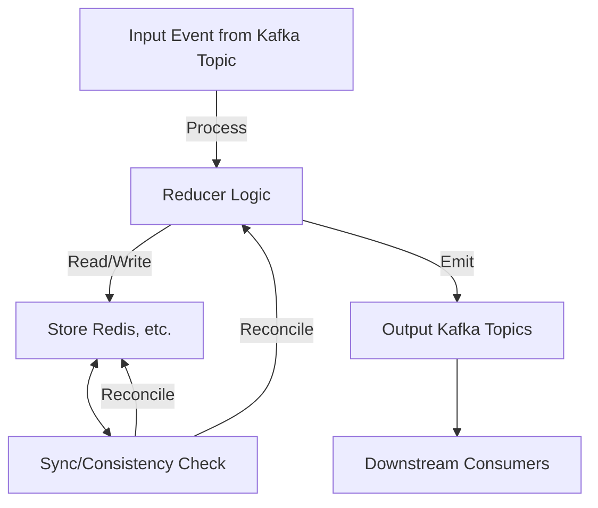

# K-state

Stateful processor for event-driven applications with Kafka and NodeJS

## Overview
K-state is a library for building robust, stateful event processors using Kafka as the source of truth and a local or remote store (e.g., Redis) for fast access and state management. It is designed for scenarios where:
- Kafka topics are the primary source of truth for events.
- The store (database/cache) is used for fast lookups and state, but not as the ultimate source of truth.
- Consistency checks and syncing mechanisms ensure the store reflects the true state from Kafka.

## Features
- Pluggable store adapters (Redis, in-memory, etc.)
- Reducer-based event processing
- Consistency checks and store syncing
- Designed for high reliability in distributed systems

## Architecture



- **Kafka** is the source of truth for all events.
- **Reducer Logic** processes each event, possibly reading/writing to the store.
- **Store** is used for fast state access, but is not the primary source of truth.
- **Sync/Consistency Check** ensures the store is consistent with Kafka.
- **Output Kafka Topics** are used to emit reactions or processed results.

## Installation

```sh
npm install kstate
```

## Usage Example

```typescript
import { createKState } from 'kstate'
import { createRedisStore } from 'kstate/stores/redis-store/redis-store'
import { Kafka } from 'kafkajs'

const kafka = new Kafka({ brokers: ['localhost:9092'] })
const store = createRedisStore({ url: 'redis://localhost:6379' })

const kstate = createKState(store, kafka)

kstate
  .fromTopic<{ name: string }>('users')
  .reduce((message, key, state) => {
    // Initialize state if it doesn't exist
    if (!state) {
      state = { name: message.name, count: 0 }
    }
    // Update state
    state.count++
    // Optionally emit a reaction to another topic
    return {
      state,
      reactions: [
        {
          topic: 'user-events',
          key,
          message: { user: state.name, event: 'updated', count: state.count }
        }
      ]
    }
  })
```

## Consistency & Syncing
- The store is periodically synced with Kafka to ensure consistency.
- If discrepancies are found, the system can reconcile state by replaying events from Kafka.
- This approach ensures eventual consistency and resilience to store failures.

## License
MIT
